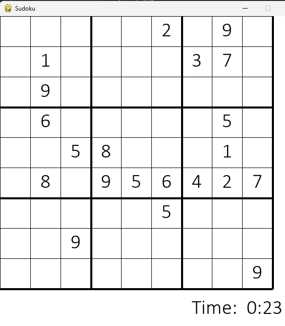

# Sudoku Generator and Solver using Python

A simple Sudoku generator and solver. Also contains a GUI built using PyGame which generates a random Sudoku challenge of varying difficulty.

To play, click on a box and type in a number. The number you pressed is "pencilled in", it appears light grey in the top corner. Once you're sure its a valid number, you can press Enter to finalise and set the value. 

If the number you've chosen does not lead to a valid solution, the game rejects it and asks you to try again. If you make five invalid moves, the game ends!

